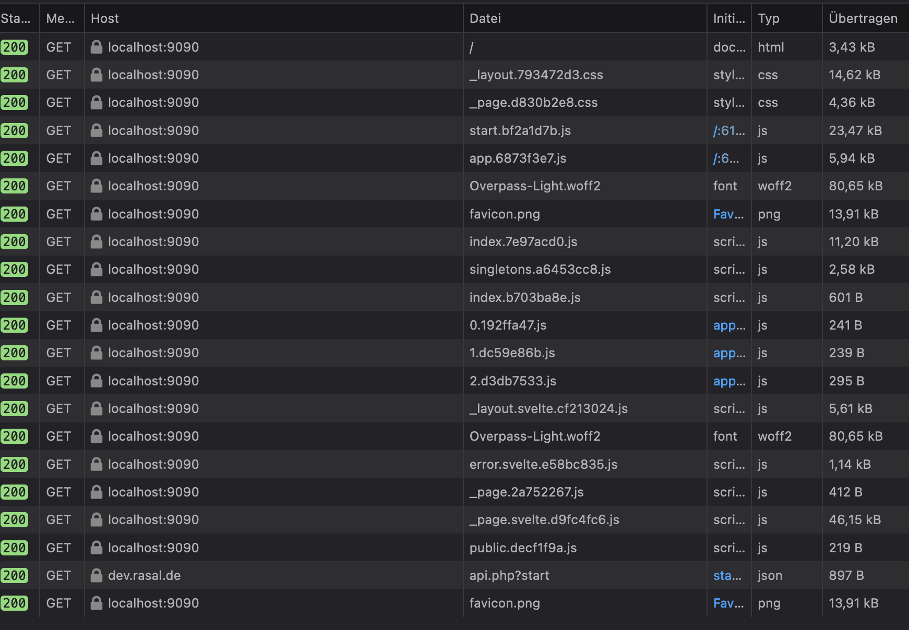

# simple Kanban

## dev links

*   <https://www.digitalocean.com/community/tutorials/js-drag-and-drop-vanilla-js-de>

*   <https://css-tricks.com/masking-vs-clipping-use/>

*   <https://github.com/metonym/svelte-accessible-accordio>

*   <https://github.com/AndrewLester/svelte-animated-details>

*   <https://www.digitalocean.com/community/tutorials/js-drag-and-drop-vanilla-js-de>

*   Adminer for SQLite <https://gist.github.com/FMCorz/f7819107c6848841372624d1becc8958>

# build1

310 kb




# build2

removed:&#x20;

```javascript
"dependencies": {
"@neodrag/svelte": "^2.0.3"
}
```

